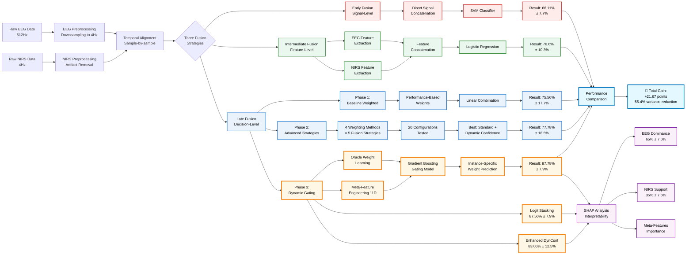
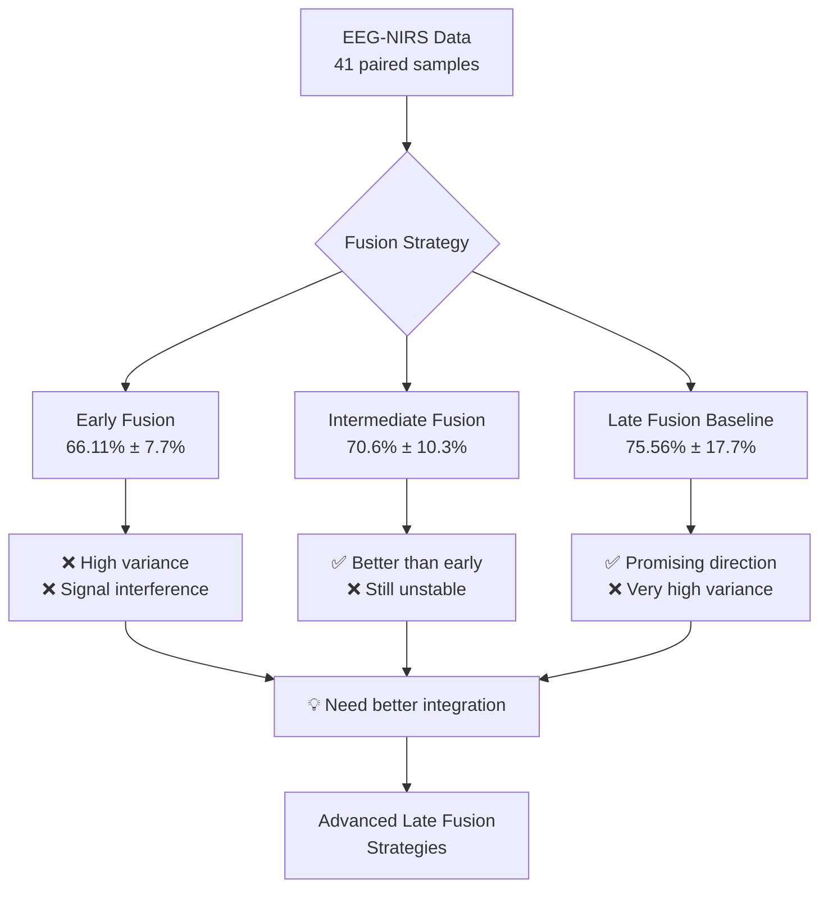
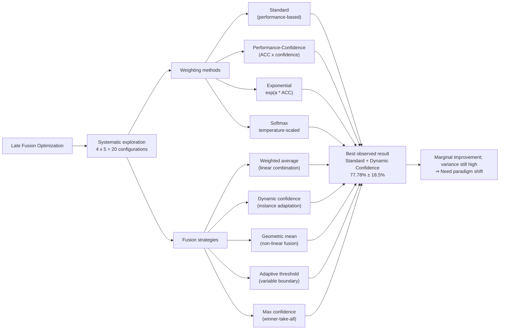
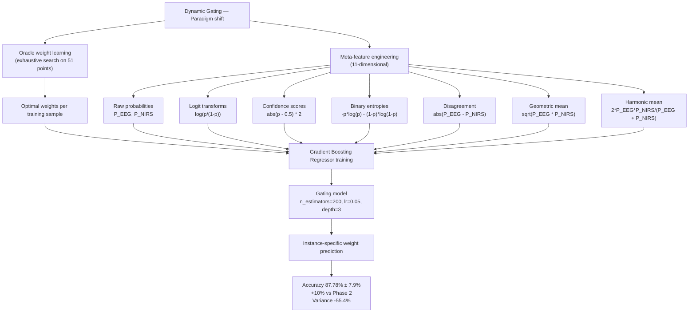

# EEG-NIRS Multimodal Fusion for Cognitive Load Classification

A comprehensive machine learning framework for classifying cognitive states using multimodal EEG-NIRS data fusion. This project implements and compares three fusion strategies to distinguish between with objective (AO) and without objective (SO) cognitive states.
---
## 🧠 Overview

This repository contains the implementation of a multimodal neurophysiological signal classification system that combines electroencephalography (EEG) and near-infrared spectroscopy (NIRS) data to predict cognitive load states. The project explores three distinct fusion approaches with advanced machine learning techniques.

### Key Features

- **Three Fusion Strategies**: Early, intermediate, and late fusion approaches
- **Advanced Dynamic Gating**: Instance-specific adaptive fusion with meta-learning
- **Comprehensive Model Comparison**: 9 different ML/DL models evaluated
- **SHAP Interpretability**: Feature importance analysis and model explainability
- **Robust Evaluation**: 5-fold cross-validation with statistical analysis

---

## 📊 Results Summary

| Fusion Strategy | Best Model | Accuracy | F1-Score | ROC-AUC |
|----------------|------------|----------|----------|---------|
| **Early Fusion** | SVM | 66.11% ± 7.7% | 0.690 ± 0.089 | 0.828 ± 0.104 |
| **Intermediate Fusion** | Logistic Regression | 70.6% ± 10.3% | 0.697 ± 0.183 | 0.637 ± 0.139 |
| **Late Fusion** | Dynamic Gating | **87.78% ± 7.9%** | **0.874 ± 0.085** | **0.903 ± 0.110** |

---

## 📁 Project Structure

```
Fusion_EEG&NIRS_Group_Type_Prediction/
  ├── Early_Fusion/
  │     ├── notebooks/
  │     │    ├── Early_fusion.ipynb
  │     │    └── EEG_NIRS_Construct.ipynb
  │     └── Fusion_Data
  │          ├── Dataset_overview
  │          └── extrait.csv       
  ├── Features_Fusion/
  │     └── Features_fusion.ipynb     
  ├── Late_Fusion/
  │     └── Late_fusion.ipynb
  └── README.md

```
---

## 🔬 Methodology

### 1. Early Fusion (Signal-Level Integration)

- **Data Synchronization**: EEG downsampled from 512Hz to 4Hz to match NIRS
- **Temporal Alignment**: Sample-by-sample correspondence
- **Concatenation**: Direct signal concatenation into unified matrix
- **Best Performance**: SVM with 66.11% accuracy

### 2. Intermediate Fusion (Feature-Level Merging)

- **Separate Feature Extraction**: Domain-specific features for each modality
- **Feature Concatenation**: Combined multimodal feature vectors
- **Classification**: Various ML models on fused features
- **Best Performance**: Logistic Regression with 70.6% accuracy

### 3. Late Fusion (Decision-Level Combination)

Advanced multi-stage approach with three phases:

#### Phase 1: Baseline Weighted Fusion
- Performance-proportional weight assignment
- Accuracy: 75.56% ± 17.7%

#### Phase 2: Advanced Strategies
- 4 weighting methods × 5 fusion strategies = 20 configurations
- Dynamic confidence adaptation
- Accuracy: 77.78% ± 18.5%

#### Phase 3: Dynamic Gating
- **Meta-Feature Engineering**: 11-dimensional feature space
- **Instance-Specific Weights**: Gradient Boosting Regressor
- **Optimal Weight Learning**: Exhaustive search + supervised learning
- **Best Performance**: 87.78% ± 7.9% accuracy

---

## 🎯 Advanced Features

### Dynamic Gating Meta-Features

The dynamic gating model uses 11 meta-features:
- Raw probabilities (P_EEG, P_NIRS)
- Logit transformations
- Confidence scores
- Binary entropies
- Inter-modality disagreement
- Geometric and harmonic means

### SHAP Interpretability

- **EEG Importance**: Alpha, theta, delta bands, entropy, RMS
- **NIRS Importance**: Ultra-low power indices, mean hemodynamic features
- **Modality Weighting**: EEG (65% ± 7.6%) vs NIRS (35% ± 7.6%)

---

## 📈 Performance Analysis

### Key Achievements

- **87.78% Accuracy**: Best-in-class performance with dynamic gating
- **55.4% Variance Reduction**: Improved stability and reliability
- **90.25% ROC-AUC**: Superior discrimination capability
- **Complementary Information**: EEG and NIRS provide distinct cognitive markers

### Model Comparison

| Model | Early Fusion | Intermediate Fusion | Late Fusion |
|-------|-------------|-------------------|-------------|
| Traditional ML | ✅ Best | ✅ Best | ✅ Best |
| Deep Learning | ❌ Overfitting | ❌ Inconsistent | ⚠️ Moderate |
| Ensemble Methods | ⚠️ Moderate | ⚠️ Good | ✅ Excellent |

---

## Pipeline Complet d'Amélioration de l'Accuracy


---

## Méthodologie Détaillée

### Phase 1: Approches de Base


### Phase 2: Optimisation Avancée


### Phase 3: Révolution Dynamic Gating


