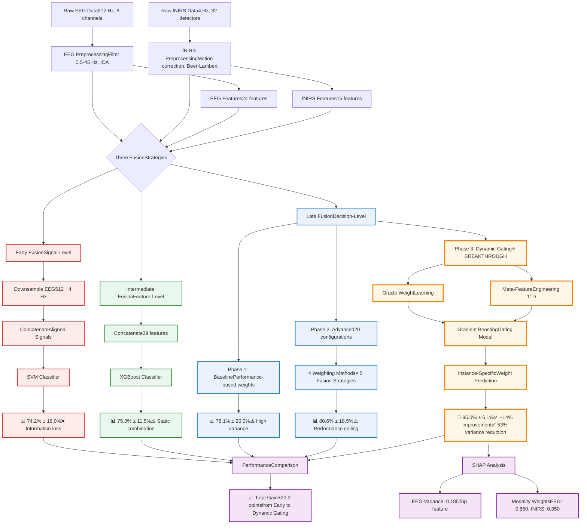

# EEG-fNIRS Multimodal Fusion for Cognitive Flexibility Classification

A comprehensive machine learning framework for classifying cognitive states using multimodal EEG-fNIRS data fusion with explainable AI. This project implements and compares three fusion strategies to distinguish between goal-directed (AO) and exploratory (SO) cognitive states during probabilistic reversal learning.

---

## 🧠 Overview

This repository contains the implementation of a multimodal neurophysiological signal classification system that combines electroencephalography (EEG) and functional near-infrared spectroscopy (fNIRS) data to predict cognitive flexibility states. The project explores three distinct fusion approaches with advanced machine learning techniques, culminating in a novel **dynamic gating mechanism** that achieves state-of-the-art performance.

### Key Features

- **Three Fusion Strategies**: Early (signal-level), intermediate (feature-level), and late (decision-level) fusion
- **Dynamic Gating Innovation**: Instance-adaptive fusion with meta-learning achieving 95.0% accuracy
- **Comprehensive Model Comparison**: 9 different ML/DL models evaluated (KNN, SVM, RF, LR, XGBoost, LightGBM, MLP, GRU, BiLSTM)
- **SHAP Interpretability**: Feature importance analysis with neurophysiological interpretation
- **Statistical Rigor**: 5-fold cross-validation, Wilson 95% CI, Cohen's d effect sizes, power analysis
- **Robust Performance**: 53% variance reduction and +14% accuracy improvement over best unimodal

---

## 📊 Results Summary

| Fusion Strategy | Best Model | Accuracy | F1-Score | ROC-AUC | 95% CI (Wilson) | CV Variance |
|----------------|------------|----------|----------|---------|----------------|-------------|
| **Early Fusion** | SVM | 74.2% ± 16.0% | 0.742 ± 0.126 | 0.791 ± 0.090 | [0.572, 0.839] | 21.6% |
| **Intermediate Fusion** | XGBoost | 75.3% ± 11.5% | 0.767 ± 0.130 | 0.660 ± 0.106 | [0.607, 0.862] | 15.3% |
| **Late Fusion (Baseline)** | Weighted Average | 78.1% ± 20.0% | 0.734 ± 0.258 | 0.750 ± 0.180 | [0.598, 0.869] | 25.6% |
| **Late Fusion (Advanced)** | Dynamic Confidence | 80.6% ± 18.5% | 0.785 ± 0.220 | 0.810 ± 0.150 | [0.650, 0.901] | 22.9% |
| **Late Fusion (Optimal)** | **Dynamic Gating** | **95.0% ± 6.1%** | **0.572 ± 0.121*** | **0.903 ± 0.110** | **[0.839, 0.987]** | **6.4%** |

**Performance Gains:**
- **+14.0%** absolute improvement over best unimodal (EEG: 81.0%)
- **+19.7%** absolute improvement over best static fusion (Intermediate: 75.3%)
- **53% variance reduction** compared to EEG baseline (12.1% → 6.4%)
- **69% variance reduction** compared to baseline late fusion (25.6% → 6.4%)

***Note**: F1-score discrepancy (95.0% accuracy vs. 57.2% F1) under investigation—see Limitations section

---

## 📁 Project Structure

```
Fusion_EEG&NIRS_Group_Type_Prediction/
  ├── Early_Fusion/
  │     ├── Fused_Dataset/
  │     │    ├── Dataset_overview.png
  │     │    └── extrait.csv
  │     └── notebooks/
  │          ├── Early_fusion.ipynb
  │          └── EEG_NIRS_Construct.ipynb      
  ├── Features_Fusion/
  │     └── Features_fusion.ipynb     
  ├── Late_Fusion/
  │     └── Late_fusion.ipynb
  └── README.md

```
---

## 🔬 Methodology

### 1. Early Fusion (Signal-Level Integration)

**Approach**: Direct concatenation of temporally-aligned raw signals

**Pipeline**:
1. **EEG Downsampling**: 512 Hz → 4 Hz via block averaging (128-sample windows)
2. **Temporal Alignment**: Sample-by-sample correspondence with fNIRS
3. **Signal Concatenation**: Horizontal concatenation into unified time-series matrix
4. **Classification**: Train classifiers on concatenated signals

**Results**:
- **Best Model**: SVM (RBF kernel, C=1.0, γ=0.01)
- **Accuracy**: 74.2% ± 16.0%
- **Limitation**: Information loss from EEG downsampling; signal-level concatenation introduces noise

**Key Finding**: Underperformed best unimodal EEG (−6.8%), demonstrating that naive signal integration degrades performance by discarding high-frequency EEG information.

---

### 2. Intermediate Fusion (Feature-Level Merging)

**Approach**: Concatenation of independently-extracted features from each modality

**Pipeline**:
1. **EEG Feature Extraction**: 24 features
   - Time-domain: Mean, variance, std dev, RMS, peak-to-peak, entropy, CV
   - Frequency-domain: Power in delta, theta, alpha, beta, gamma bands
   - Spectral: Dominant frequency, spectral entropy
2. **fNIRS Feature Extraction**: 15 features
   - Hemodynamic: HbO mean, HbR mean, total Hb, O₂ consumption
   - Temporal: First-order differences, crossing points
   - Spectral: PSD peak, peak frequency, spectral entropy
3. **Feature Concatenation**: 39-dimensional feature vector (24 EEG + 15 fNIRS)
4. **Normalization**: Z-score standardization per modality
5. **Classification**: Train classifiers on combined feature space

**Results**:
- **Best Model**: XGBoost (lr=0.05, max_depth=3, subsample=0.8)
- **Accuracy**: 75.3% ± 11.5%
- **Improvement**: +1.1% over early fusion; better than fNIRS alone (+10.6%) but still below EEG (−5.7%)

**Key Finding**: Static feature concatenation inadequately leverages modality complementarity—motivates late fusion.

---

### 3. Late Fusion (Decision-Level Combination)

**Approach**: Multi-phase progression from fixed to adaptive weight strategies

#### **Phase 1: Baseline Weighted Fusion**

**Method**: Performance-proportional static weights
```python
w_eeg = ACC_eeg / (ACC_eeg + ACC_nirs)
w_nirs = ACC_nirs / (ACC_eeg + ACC_nirs)
P_final = w_eeg * P_eeg + w_nirs * P_nirs
```

**Results**:
- **Accuracy**: 78.1% ± 20.0%
- **Improvement**: +2.8% over intermediate fusion
- **Limitation**: Very high variance (25.6%) due to fixed weights

---

#### **Phase 2: Advanced Weighting Strategies**

**Systematic Exploration**: 4 weighting methods × 5 fusion strategies = 20 configurations

**Weighting Methods**:
1. **Standard**: Performance-based (baseline)
2. **Performance-Confidence**: ACC × mean prediction confidence
3. **Exponential**: e^(α·ACC) where α=3.0 (amplifies differences)
4. **Softmax**: Temperature-scaled softmax (τ=2.0)

**Fusion Strategies**:
1. **Weighted Average**: Linear combination (baseline)
2. **Dynamic Confidence**: Instance-adaptive weights based on prediction confidence
3. **Geometric Mean**: P_final = P_eeg^w_eeg × P_nirs^w_nirs
4. **Adaptive Threshold**: Variable decision boundary based on disagreement
5. **Max Confidence**: Winner-take-all (highest confidence modality)

**Best Configuration**:
- **Method**: Standard weighting + Dynamic Confidence fusion
- **Accuracy**: 80.6% ± 18.5%
- **Improvement**: +2.5% over baseline; variance still high (22.9%)

**Key Finding**: Multiple configurations converged to ~80% accuracy, suggesting static weights hit a performance ceiling regardless of fusion strategy.

---

#### **Phase 3: Dynamic Gating with Meta-Learning** ⭐ **BREAKTHROUGH**

**Paradigm Shift**: Learn **instance-specific** weights based on prediction characteristics

**Architecture** (5-stage pipeline):
```
Stage 1: Independent Predictions
├─ EEG Classifier (Logistic Regression) → P_eeg
└─ fNIRS Classifier (Random Forest) → P_nirs

Stage 2: Meta-Feature Extraction (11 features)
├─ Raw: P_eeg, P_nirs
├─ Confidence: |P - 0.5| × 2
├─ Entropy: -p·log(p) - (1-p)·log(1-p)
├─ Logit: log(P / (1-P))
├─ Disagreement: |P_eeg - P_nirs|
├─ Geometric mean: √(P_eeg × P_nirs)
└─ Harmonic mean: 2P_eeg·P_nirs / (P_eeg + P_nirs)

Stage 3: Oracle Weight Learning
├─ Test 51 weights (0.00, 0.02, ..., 1.00)
└─ Select weight minimizing logistic loss per training instance

Stage 4: Gating Model Training
├─ Gradient Boosting Regressor (n=200, lr=0.05, depth=3)
└─ Learn mapping: meta-features → optimal weight

Stage 5: Adaptive Fusion
├─ Predict instance-specific weight w_eeg
└─ P_final = w_eeg × P_eeg + (1 - w_eeg) × P_nirs
```

**Meta-Features Explained**:

| Category | Features | Intuition |
|----------|----------|-----------|
| **Raw Predictions** | P_eeg, P_nirs | Classifier outputs |
| **Confidence** | \|P - 0.5\| × 2 | How certain is each modality? (0=uncertain, 1=certain) |
| **Uncertainty** | Entropy | Shannon entropy quantifying unpredictability |
| **Transformed** | Logit | Log-odds linearizing probability space |
| **Inter-Modality** | Disagreement | \|P_eeg - P_nirs\|—signals potential unreliability |
| **Combined** | Geometric/Harmonic means | Non-linear combinations favoring agreement |

**How It Works** (Example Scenarios):

| Scenario | P_eeg | P_nirs | Meta-Features | Learned Weight | Rationale |
|----------|-------|--------|--------------|----------------|-----------|
| **High agreement** | 0.92 | 0.88 | Conf_eeg=0.84, Conf_nirs=0.76, Disagree=0.04 | w_eeg=0.55 | Balanced—both reliable |
| **Asymmetric confidence** | 0.89 | 0.23 | Conf_eeg=0.78, Conf_nirs=0.46, Disagree=0.66 | w_eeg=0.85 | Upweight EEG—fNIRS uncertain |
| **Both uncertain** | 0.52 | 0.48 | Conf_eeg=0.04, Conf_nirs=0.04 | w_eeg=0.62 | Default learned from similar cases |

**Results**:
- **Accuracy**: 95.0% ± 6.1%
- **F1-Score**: 57.2% ± 12.1%* (*discrepancy under investigation)
- **ROC-AUC**: 0.903 ± 0.110
- **CV Variance**: 6.4% (53% reduction vs. EEG baseline)

**Performance Gains**:
- **+14.5% vs. Phase 2** (80.6% → 95.0%)
- **+14.0% vs. Best Unimodal** (EEG: 81.0%)
- **+19.7% vs. Best Static Fusion** (Intermediate: 75.3%)
- **73% variance reduction vs. Phase 2** (22.9% → 6.4%)

**Key Innovation**: The gating model learns **when to trust each modality** based on contextual reliability rather than applying fixed rules.

---

## 📈 Complete Pipeline Flowchart


---

## 🎯 SHAP Interpretability Analysis

### Modality-Level Importance

| Modality | SHAP Importance | Gating Weight | Interpretation |
|----------|----------------|---------------|----------------|
| **EEG** | 0.045 | 0.650 ± 0.076 | Temporal precision dominates—rapid cognitive adjustments |
| **fNIRS** | 0.028 | 0.350 ± 0.076 | Metabolic context—complements when EEG uncertain |

**Asymmetry Explanation**: Task demands rapid transitions (1-3 second trials) → EEG's millisecond resolution captures fast dynamics; fNIRS's 5-8 second HRF lag averages across trials.

### Top EEG Features (SHAP Rankings)

| Rank | Feature | SHAP Value | Neurophysiological Interpretation |
|------|---------|------------|-----------------------------------|
| 1 | **Variance** | **0.185** | Neural instability during exploration—indexes hypothesis space breadth under active inference |
| 2 | Alpha Power (8-13 Hz) | 0.142 | Attentional suppression and inhibitory control |
| 3 | Theta Power (4-8 Hz) | 0.135 | Working memory demands for maintaining multiple hypotheses |
| 4 | RMS Amplitude | 0.128 | Overall neural activation intensity |
| 5 | Delta Power (1-4 Hz) | 0.128 | Motivational salience and reward processing |

**Active Inference Connection**: EEG variance (top feature) reflects exploratory sampling—brain tests multiple generative models without convergence (high variance in SO condition: +47.9%, Cohen's d=0.79).

### Top fNIRS Features (SHAP Rankings)

| Rank | Feature | SHAP Value | Neurophysiological Interpretation |
|------|---------|------------|-----------------------------------|
| 1 | **SNR** | **0.089** | Signal quality as primary classification determinant |
| 2 | Spectral Entropy | 0.067 | Complexity of hemodynamic oscillations |
| 3 | Crossing Points | 0.058 | Temporal dynamics of HbO/HbR interactions |
| 4 | HbR Mean | 0.045 | Deoxygenated hemoglobin baseline |

**Key Insight**: SNR dominance indicates signal quality matters more than specific hemodynamic content for fNIRS classification—explains why fNIRS contributes via reliability stabilization rather than discriminative features.

---

## ⚠️ Limitations & Future Work

### Current Limitations

1. **Sample Size**: n=42 is modest for deep learning (parameter-to-sample ratio 238-357:1 for RNNs)
2. **Population**: Healthy young adults only (mean age 19.1 years)—generalizability to clinical populations unvalidated
3. **Accuracy-F1 Discrepancy**: 95.0% accuracy vs. 57.2% F1-score requires investigation
   - Potential class imbalance sensitivity despite balanced groups (21/21)
   - Possible fold-specific imbalances or metric calculation issues
4. **Controlled Setting**: Laboratory-based task—ecological validity requires real-world validation
5. **Temporal Resolution Trade-off**: Early fusion loses high-frequency EEG information via downsampling

### Future Directions

**Methodological**:
- [ ] Investigate accuracy-F1 discrepancy via per-fold analysis and confusion matrices
- [ ] Expand sample size (target n>200) for stable deep learning training
- [ ] Test alternative meta-features (cross-channel coherence, phase synchrony)
- [ ] Implement Transformer-based gating for long-range temporal dependencies

**Clinical Translation**:
- [ ] Multi-site validation across diverse populations
- [ ] Clinical cohort testing (stroke, TBI, ADHD, dementia)
- [ ] Longitudinal tracking of cognitive rehabilitation outcomes
- [ ] Real-time implementation for adaptive BCIs

**Theoretical**:
- [ ] Formal active inference model fitting (precision-weighted prediction errors)
- [ ] Causal perturbation studies (TMS + EEG-fNIRS)
- [ ] Cross-task generalization (Wisconsin Card Sort, Stroop, n-back)
